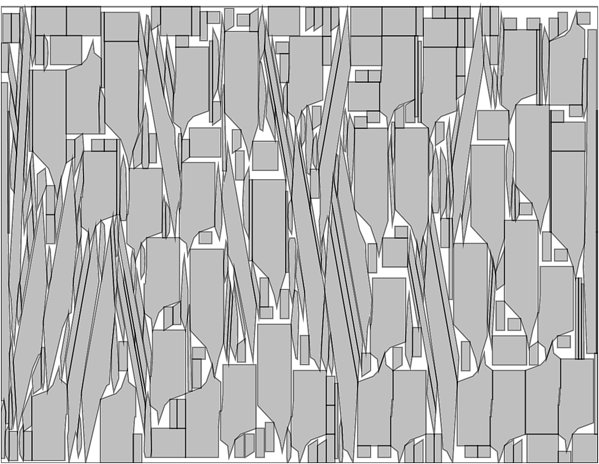
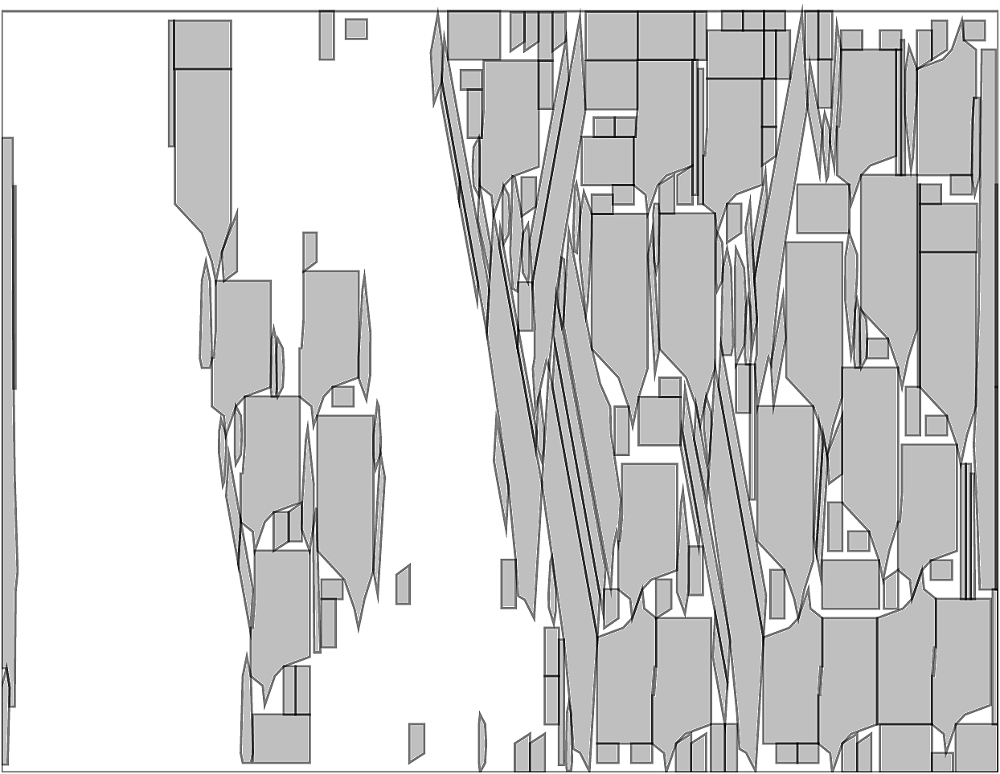
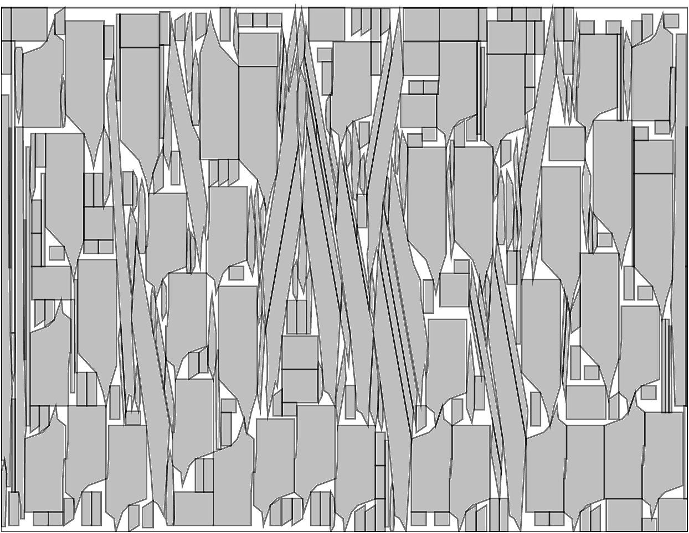

# An iterated destroy/repair heuristic for irregular stock cutting

This repository holds my implementation of an iterated destroy/repair heuristic for irregular stock cutting, made for the course [CMP268-Heuristic Search Methods](https://www.inf.ufrgs.br/~mrpritt/doku.php?id=cmp268:homepage) at [INF/UFRGS](https://www.inf.ufrgs.br/). 

The problem asks to place non-intersecting irregular polygons, selected from a given set, on a rectangle of fixed dimensions. The goal is minimize the unused area. The example below shows an initial solution, the partially-destroyed solution, and the reconstructed solution obtained by a semi-greedy heuristic. The algorithm basically repeats this process iteratively.

Initial solution (81.74% filled) | Destroy (~30% area)  | Repair (82.18% filled)
:-------------------------:|:-------------------------:|:-------------------------:
  |   | 

Initial solutions are obtained with a reimplementation of the algorithm of [Dalalah et al. (2014)](http://dx.doi.org/10.1016/j.jmsy.2013.11.003). You can read the full details of the algorithm, in Portuguese, in `report-in-portuguese.pdf`.

## Running the code

1. Unpack the instances in `instances.tar.gz`.
1. Compile the code under `src` using `make`. Requires [Boost](boost.org).
1. Run using `./cut --in {instance} --phi {rotationAngle} --time {timeLimit} --out {outFile}`. 
1. To visualize the output, run `python plot.py {outFile}`. It generates a pdf with the same file stem in the current directory.

Here, pieces will be allowed to be rotated by multiples of `phi` degrees. The smaller `phi` is, the harder the problem. Try e.g. `phi=5`, `phi=10` or `phi=15` to see the difference. 

